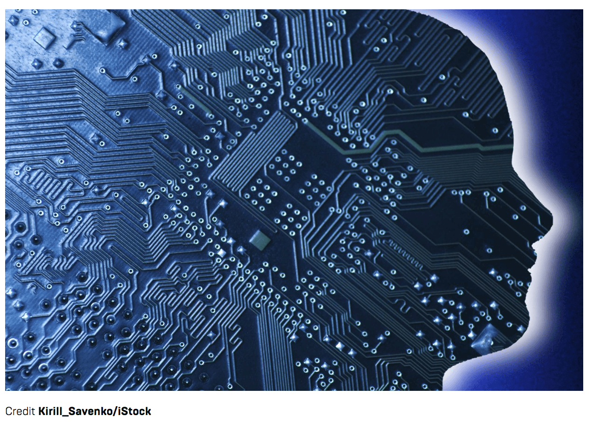
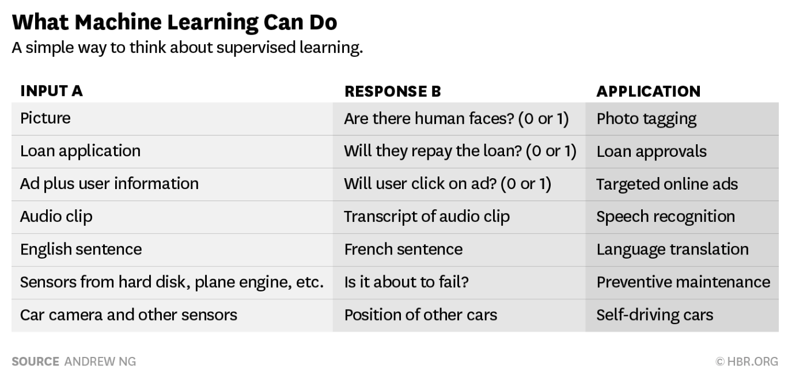
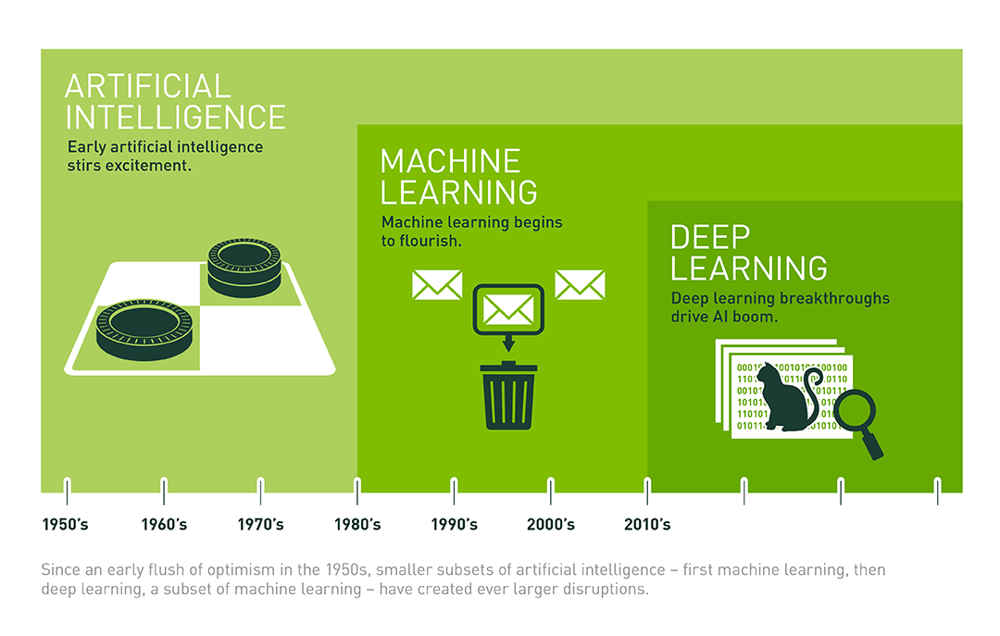

It’s 9:00 am on a Tuesday morning. You’ve awoken, scanned the headlines on your phone, responded to an online post, ordered a new pair of shoes, and are driving to work, listening to some great new music on Spotify.

You’ve also used artificial intelligence (AI) more than a dozen times — to call up local weather report, to make a purchase, to be alerted to an upcoming traffic jam, and even to identify an unfamiliar song.

AI is already pervasive in our world, and it’s making a huge difference in our everyday lives. But this is not the AI you’ve seen in sci-fi movies, with nervous scientists clacking on keyboards and attempting to halt machines from destroying the world.

Your smartphone, house, bank, and car already use AI on a daily basis. Sometimes it’s obvious, like when you ask Siri to get you directions to the nearest gas station, or Facebook suggests a friend for you to tag in an image you posted online. Sometimes less so, like when you use your Amazon Echo to make an unusual purchase on your credit card (like that goofy holiday sweater) and don’t get a fraud alert from your bank.

AI is going to bring major shifts in society through developments in self-driving cars, medical image analysis, better medical diagnosis, and personalized medicine. And it will also be the backbone of many of the most innovative apps and services of tomorrow. But for many, it still remains a mystery.

What is AI, Really?
------

Part of the mystery surrounding AI is due to the media’s unrealistic picture of the power of AI. Perhaps harkening to images of dystopian AI systems such as Skynet, high profile figures such as Elon Musk and Stephen Hawking have publicly raised their concerns about how a powerful AI could take over the world in decades to come.

Modern AI will significantly transform the capabilities of computers and smartphones alike. But it’s not magic — and it’s certainly not the Terminator. To understand AI on a more concrete level, let’s cut through the hype and see what AI really is doing today.

Broadly speaking, AI is any form of intelligence (however you want to define that) exhibited by machines. In computer science specifically, AI research largely centers around the study of "intelligent agents": any device that perceives its environment and takes actions that maximize its chance of success at some goal. Google’s self-driving cars and DeepMind’s superhuman Go program, AlphaGo, are prime examples of such intelligent agents. While these agents employ algorithmic techniques somewhat inspired by what we know about the brain, such human-centric modeling is not necessary in order for something to be considered "AI."

In more concrete terms, today’s central problems in AI include creating agents that are capable of **planning** sequences of decisions, **reasoning** about the world around them, and **learning** from experience. The vast majority of AI breakthroughs in recent years, have been powered by the last of the three. For these reasons, "**machine learning**" has become quite a buzzword in the tech community, and to a certain extent has even begun to be used interchangeably with the term “AI” itself. In the following sections — and for the remainder of this course — we will introduce you to the core ideas behind machine learning, show you how these ideas can be used to solve meaningful problems in the world around us, and hopefully prepare you to implement some machine learning algorithms on your own.

Machine Learning:
------

While computer scientists have made outstanding progress in the last several decades simply by giving computers sets of concrete instructions to execute, there are many problems for which hard-coded solutions are simply too difficult to implement. Imagine, for example, that you wanted to teach a computer to recognize pictures of cats. Ideally, you would upload a picture to your program as its input, and it would return a simple "yes" or “no” as output corresponding to whether or not the image you uploaded was indeed a cat. Sounds simple at first, right? To actually implement such a program, though, think of all the features that you’d have to train your program to look for: eyes, ears, a tail, paws, and more, all of which could appear at completely differently angles depending on the specific image. Realistically, such a tool is far too difficult to explicitly program using traditional methods.

This may seem like a frivolous problem at first, but now consider the possibility where instead of writing a program to differentiate between cats and other animals, we want to assist doctors by creating a program that looks at patients’ lung scans and differentiates between benign and malignant tumors. A misdiagnosis could mean either months or years of possibly unnecessary treatments, or even worse, a missed opportunity to combat the cancer while still its early stages. Suddenly, this decision problem begins to seem like a very real one.

That’s where machine learning comes in. Machine learning (ML) is the idea that rather than having to explicitly program every single step, we should instead be able to feed our program examples of images (some containing cats, and some containing other animals/objects), along with labels corresponding to what the images represent (i.e. cat or not cat), and have the program eventually learn to distinguish images of cats on its own — no hard-coding necessary. So, while AI and machine learning are very much related, they are not quite the same thing. Machine learning is a specific branch of AI that Stanford defines as "the science of getting computers to act without being explicitly programmed," paving the way for new technologies that wouldn’t be possible otherwise.

What is Learnable?
------

Today, there are three broad categories of machine learning that researchers typically study: supervised learning, unsupervised learning, and reinforcement learning, each with varying goals and current degrees of success in the field. Mathematically speaking, these machine learning categories can often be framed as different optimization problems. For example, we could, through a variety of optimization algorithms, train a program to find the best possible mapping from a 3D lung scan to a lung cancer diagnosis, or the best possible action in a game of chess given the current board.

**1. Supervised Learning:** This is when researchers tell the machine what the correct answer is for a particular input: here is the image of a car, the correct answer is "car." It is called supervised learning because the process of an algorithm learning from the labeled training dataset is similar to showing a picture book to a young child. The adult knows the correct answer and the child makes predictions based on previous examples. This is the most common technique for training neural networks and other machine learning architectures. An example might be: Given the descriptions of a large number of houses in your town together with their prices, try to predict the selling price of your own home. Much of AI’s recent progress is through this one type, in which some input data (A) is used to quickly generate some simple response (B) — much like any other mathematical function. What’s special about supervised learning is that after seeing enough training examples, the machine can gradually optimize itself so that it learns to generate the correct output (B) from the input (A) on its own. For example:

A→B is far from the sentient robots that science fiction has promised us. Human intelligence also does much more than A→B. These A→B systems have been improving rapidly, and the best ones today are built with a technology called deep learning or deep neural networks, which were loosely inspired by the brain. But these systems still fall far short of science fiction. Many researchers are exploring other forms of AI, some of which have proved useful in limited contexts; there may well be a breakthrough that makes higher levels of intelligence possible, but there is still no clear path yet to this goal.

Nevertheless, big technology players such as Google and Nvidia are currently hard at work developing this type of machine learning; desperately pushing computers to learn the way a human would in order to progress what many are calling the next revolution in technology. And for good reason, too. Machine learning techniques like these are helping researchers discover how the human genome works, be able to detect and prevent fraud, and connect the world through accurate machine translations, among other uses. At USC’s own Teamcore AI Lab, supervised learning is currently being used to help environmental non-profits by training computers to look at aerial drone footage from wildlife parks (A) and decide whether or not the footage contains poachers and/or endangered animals (B).

**2. Unsupervised Learning:** Much of what humans and animals learn, they learn it in the first hours, days, months, and years of their lives in an unsupervised manner: we learn how the world works by observing it and seeing the result of our actions. No one is here to tell us the name and function of every object we perceive. We learn very basic concepts, like the fact that the world is three-dimensional, that objects don't disappear spontaneously, that objects that are not supported fall. In computer science, unsupervised learning could be used to find patterns in data even without being given any "correct answers." We currently do not know how to do this with machines, at least not at the level that humans and animals can. Our lack of AI techniques for unsupervised learning is one of the factors that limits the progress of AI at the moment.

**3. Reinforcement Learning:** This is focused on the problem of how an agent ought to act in order to maximize its rewards, and it's inspired by game theory and behaviorist psychology. In a particular situation, the machine picks an action or a sequence of actions, and gets a reward. This is frequently used when teaching machines to play and win games, like chess, backgammon, go, or simple video games. At Teamcore, these same reinforcement learning techniques have been applied to wildlife poaching simulations to teach AI agents to find optimal anti-poaching patrol routes over time. However, one issue is that in its purest form, reinforcement learning requires an extremely large number of trials to learn even simple tasks.

**Deep Learning:** Ok, so it’s not technically one of the three categories of machine learning; but that doesn’t mean it’s not worth talking about. Deep learning is a relatively new subset of machine learning techniques (that can be applied to any of the three categories of ML) in which artificial neural networks — algorithms inspired by the way neurons work in the brain — find patterns in raw data by combining multiple layers of artificial neurons. As number of layers increases, so does the neural network’s ability to learn increasingly abstract concepts. Deep Learning’s ability to learn abstract concepts has played a huge role in the AI boom of the past couple years.

For example, neural networks can learn how to recognize human faces. How? The first layer of neurons takes pixels from example images, the next layers learn the concept of how pixels form an edge, then that layer passes that knowledge to other layers, combining that knowledge of edges to learn the concept of a face. This process of layering knowledge continues until the neural network algorithms recognize specific features, and ultimately specific faces. To go back to the lung cancer example, deep learning techniques have also been used to take raw pixels from 3D lung scans, and using a number of processing layers, learn to detect increasingly abstract features to the point of eventually being able to distinguish between tumors and regular tissue.

Conclusion:
------

Despite recent progress, AI and machine learning still have a ways to go. However, these technologies have already made their way into plenty of devices, and may eventually reshape society much like the internet has done already. But as mentioned before, these technologies aren’t magic — rather, they’re largely a combination of applied math and statistics, channeled through programs made possible by computer science — and they’re definitely not evil. In fact, AI and machine learning can and in many cases, has already been used for social good. In later lessons, we’ll talk more specifically about what types of math go on behind the scenes to make machine learning possible, and show you some more examples of machine learning being put to good use in the real world. Until then, hopefully you can rest easy knowing that the Terminator won’t be coming for you any time soon.

(As a sneak preview, here's an 18-minute video that provides a really well-thought out introduction to the basic mathematical ideas behind machine learning: **[Machine Learning Introduction (18:52)](https://www.youtube.com/watch?v=-rMMTv7XLYw)**. If you're going through our curriculum, definitely give it a watch before the next lesson. It'll be worth it.)

 

### Sources

1. [http://www.wired.co.uk/article/machine-learning-ai-explained](http://www.wired.co.uk/article/machine-learning-ai-explained)
2. [https://code.facebook.com/posts/384869298519962/artificial-intelligence-revealed/](https://code.facebook.com/posts/384869298519962/artificial-intelligence-revealed/)
3. [https://hbr.org/2016/11/what-artificial-intelligence-can-and-cant-do-right-now](https://hbr.org/2016/11/what-artificial-intelligence-can-and-cant-do-right-now)
4. [https://en.wikipedia.org/wiki/Artificial_intelligence](https://en.wikipedia.org/wiki/Artificial_intelligence)
5. [https://blogs.nvidia.com/blog/2016/07/29/whats-difference-artificial-intelligence-machine-learning-deep-learning-ai/](https://blogs.nvidia.com/blog/2016/07/29/whats-difference-artificial-intelligence-machine-learning-deep-learning-ai/)
